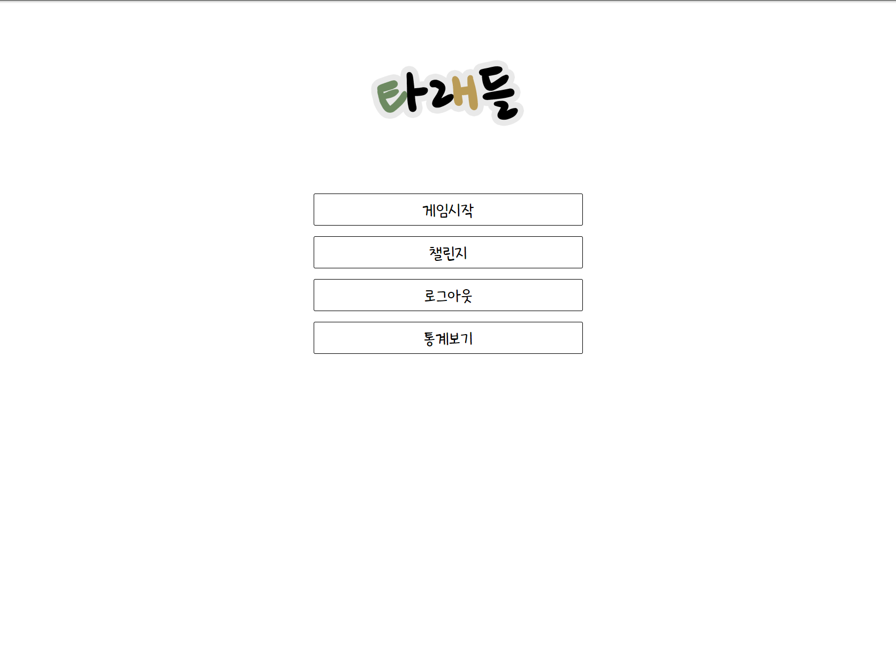
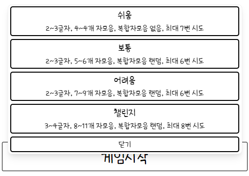
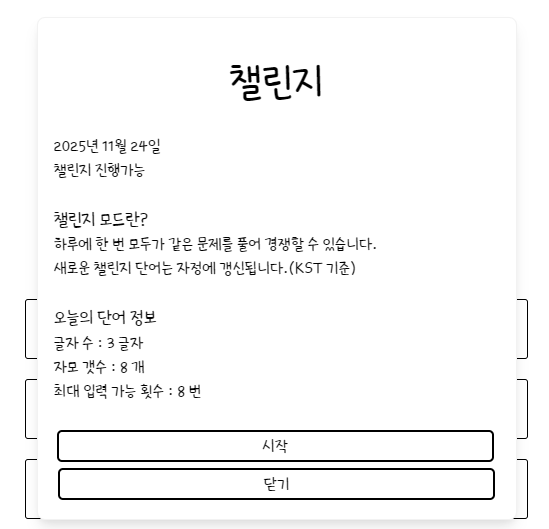
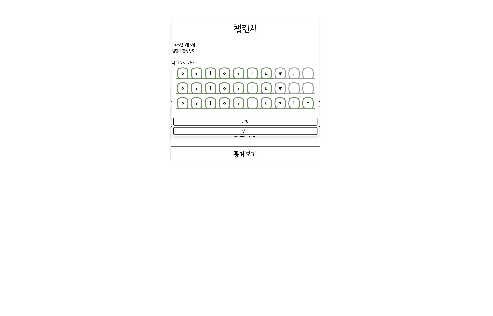
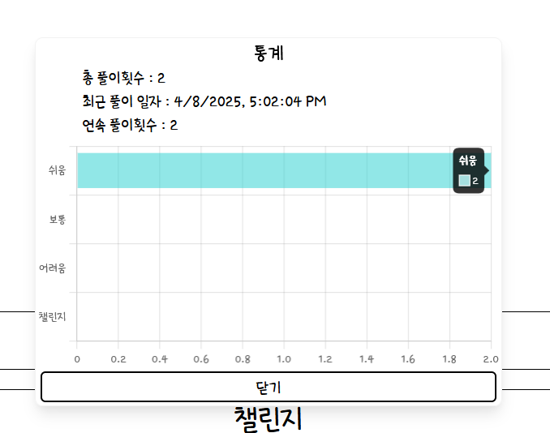
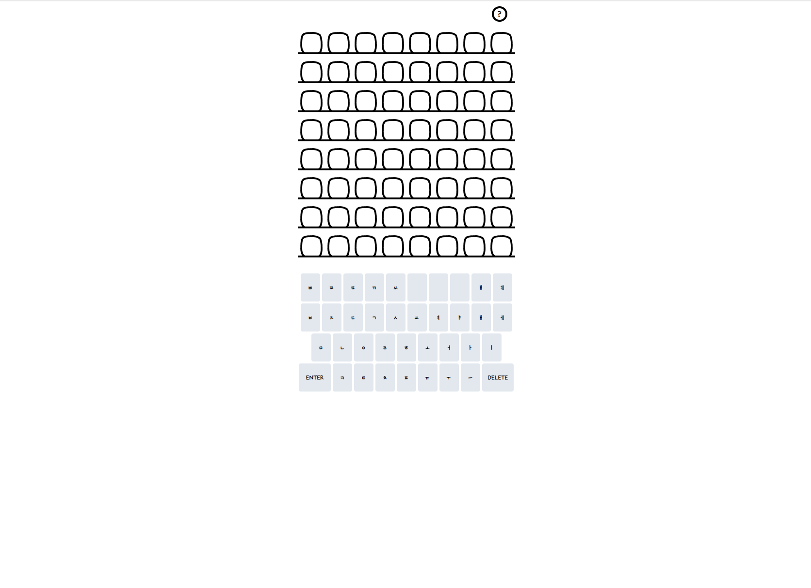
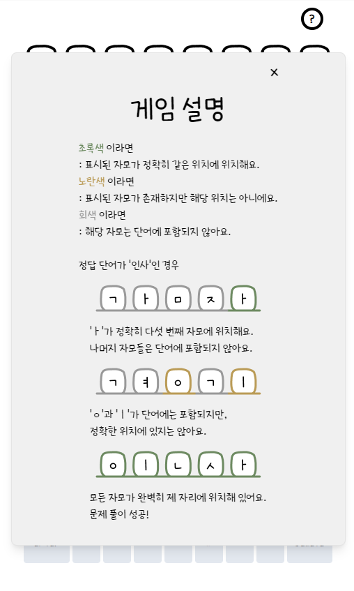
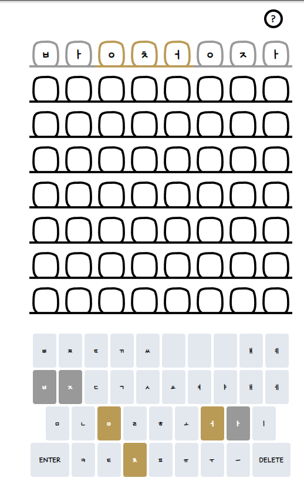
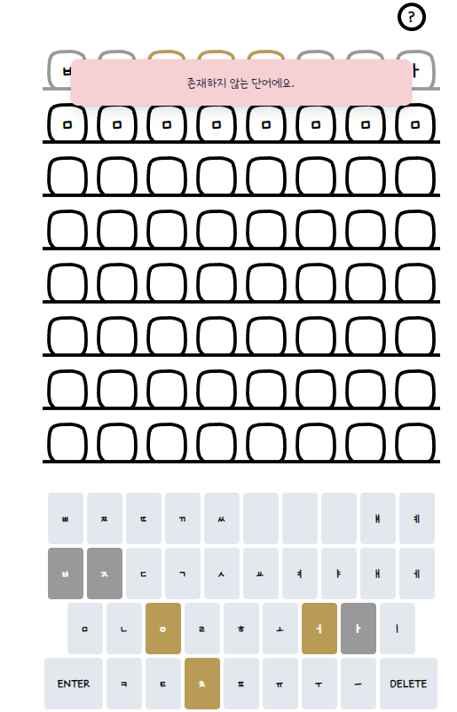
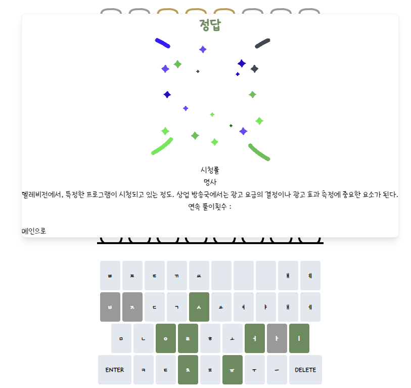

## 한글로 풀어보는 워들, 타래들

### 프로젝트 설명  

기존에 존재하는 게임인 워들 게임을 참고하여 한글로 풀 수 있는 워들 게임을 만들었습니다.

### 프로젝트 내 역할

해당 프로젝트는 웹과 모바일로 분리된 프로젝트로, 저는 그 중에서도 웹 프론트엔드를 맡아 해당 프로젝트의 웹 버전을 개발했습니다.

### 기술 스택

React.js, Typecript, Tailwind, Chart.js

### 프로젝트 진행 설명

기본 페이지입니다  
로그인을 하지 않았을 경우 로그인 버튼만이 존재하고, 구글 연동을 통해 로그인을 시도합니다.  
각 버튼을 클릭할 경우 모달 형태로 표시됩니다.

  
게임 시작 버튼 클릭시 난이도 선택창이 표시됩니다.  

  
챌린지 버튼 클릭시 챌린지 설명과 시작 버튼이 표시됩니다.  

  
챌린지 완료 후에는 이렇게 문제풀이 현황을 표시해줍니다.  

  
통계 버튼의 경우 해당 유저가 지금까지 푼 문제를 표시합니다.  
Chart.js의 경우 해당 그래프를 출력하기 위해 사용하였습니다.  
  
  
다음으로는 문제 풀이 페이지입니다.
  

  
물음표 버튼 클릭시 게임 설명 모달이 출력됩니다. 해당 설명을 통해 게임을 이해할 수 있습니다.

  
단어 작성 후 Enter버튼 클릭시 게임 설명과 동일하게 결과가 출력되며, 존재하지 않는 단어일 경우 경고 메시지가 출력됩니다.

  
정답을 맞출 경우 축하 gif 출력과 함께 단어가 출력됩니다. 챌린지 모드의 경우 해당 모달처럼 좌하단 메인으로 버튼만 존재하고, 일반 문제의 경우 다른문제 풀기가 출력됩니다.  
모든 기회를 소진하고 정답을 맞추지 못했을 때에는 단어는 출력되나 축하 gif가 출력되지 않습니다.

## 프로젝트 감상
  
그동안 프론트엔드 개발은 팀원과 협업하며 진행했으나, 이번 프로젝트에서는 혼자서 웹 개발을 전담하며 개발력 향상의 중요한 계기를 마련할 수 있었습니다.  
개발 중 마주친 문제들을 직접 해결하며 성장했고, 처음으로 ChatGPT를 활용해보면서 AI가 문제 해결의 이정표 역할을 할 수 있음을 배웠습니다.  
물론 무조건적인 신뢰보다는 적절한 활용과 주의가 필요하다는 점도 깨달았고, 앞으로도 이러한 최신 도구들을 적극적으로 활용하며 개발 역량을 더욱 키워나가고자 합니다.